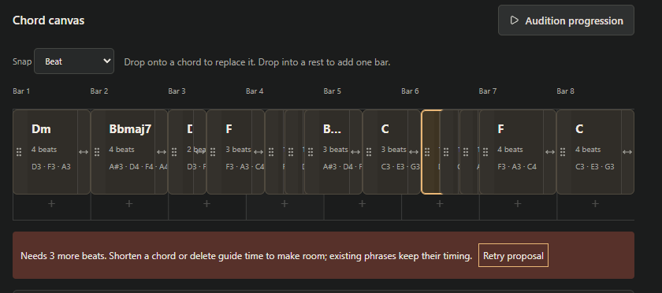

# Chord cards and continuous sound tuning

2026-09-30. Follow-up to the completed five-slice workflow patch; preserve its completed records and ProjectDocument v1.

User annotations supersede the earlier suggestion-button/form interaction and cancellation on sound-setting changes.

- Compact chord palette cards: click auditions; drag directly to the bar canvas. Remove the separate Preview/Insert/Replace controls and global At beat/Bars/Insert chord form. Retain a collapsible custom-card composer and exact selected-chord inspector.
- Drop on one occupied chord replaces notes/symbol, preserving its ID/start/duration. Drop into a rest inserts one bar with existing guide-only ripple rules. Preview the action, snap, reject ambiguous overlaps and overflow, and preserve the candidate. Existing card drags reorder before the whole target chord, translating canvas coordinates into the timing command's after-removal coordinates; rest destinations remain snapped. Do not split destination chords during card reordering.
- Expose an end grab boundary for chord duration, with snapped pointer/touch resizing, keyboard arrows, one Undo per gesture, cancellation and invalid-end rejection. Retain inspector duration entry.
- Keyboard placement: D picks up the focused card, arrows choose position, Enter drops, Escape cancels. Keep click-to-audition and native focus rules. Palette dragging uses captured pointer input for mouse, touch and pen so scrolling or focus cannot interrupt browser-native drag initiation. Occupied move targets choose the preceding/following boundary by pointer half; movement buttons use adjacent whole-chord boundaries.
- Sound/mixer tuning keeps current audition activity, pending loads and scheduled notes alive. Apply effective controls to sounding voices and current settings to future notes. Cancel on instrument/destination changes and retain stale cancellation for musical generator/harmony/section edits. Instrument topology changes under the same instrument keep current voices and apply the new topology on the next note. Stop/toggle/loading cancellation remains reliable.

## Checkpoints

- [x] Palette clicks/drop/keyboard placement, custom cards, rest/occupied/overflow/legacy targets, and unchanged instrumental clips.
- [x] Pointer and keyboard duration gestures, snapping, Undo/cancel/invalid end, responsive hit targets.
- [x] Continuous tuning with sustained/future notes, loading, instrument swap and Stop silence; seeded generation unchanged.
- [x] TypeScript, lint, focused unit/browser regressions and production build.
- [x] Publish same Site and record verified result.

Independent implementation from Chordz and licensed assets; no Zrythm material, editor overhaul, system or hardware changes.

Additional annotations: polish the voicing inspector with musical note-name/octave fields, grouped actions and optional advanced details; remove the permanent yellow insertion line while retaining drag feedback.

The final supplied screenshot demonstrated accumulating split fragments and short-card width overflow after moves. Keep existing fragments loadable without rewriting their timing. New canvas moves preserve chord count/IDs/durations; remove minimum card widths so short spans render inside their true time. Repeated forward/backward moves, rests, Undo, and fragment geometry pass. The screenshot is retained as review evidence, not product content.

## Verification

52 Vitest cases, all 32 Chrome scenarios, 20 focused Edge scenarios, TypeScript, zero-warning lint and the production Worker/client build pass. Both original demos and 48 seeded generator fixtures remain exact. Existing ownership/recovery, all six v1 round-trip variants, MIDI, recording-stem timing, backup restoration and the five-minute 16-track simulated-recording/cloud-reopen/WAV workflow pass. See `docs/evidence/chord-card-patch.json`; previous patch evidence is preserved separately.

New checks cover rest insertion/occupied replacement, custom and keyboard cards, protected Stop and Undo during pickup, emulated-touch Escape followed by late release, repeated full-section movement without fragments, short-span geometry, snapped resize/Undo/Escape/overflow, musical octave fields and desktop/tablet/mobile overflow. Continuous tuning is checked in the UI and at the audio output: sustained filters/expression, future algorithm changes, unchanged preview identity, FM carrier/modulator detune, queued bend, release shortened during attack, quiet reverb-bus migration, tuning during delayed sample loading and instrument swap cancellation. Common-output cancellation remains finite and below the approved thresholds beyond the last event/effect tail.

An initial native drag test exposed interrupted drag initiation during scrolling; captured pointer dragging resolves it. Touch automation explicitly waits for the closing dialog overlay. Two initial test expectations (an unchanged octave and a renamed sound control) were corrected. The build helper's Windows package-manager invocation failed; the existing project build command completed successfully and its unchanged output is reused for publication.

Physical microphone/controller/touch-device tests and human listening remain outstanding. Earlier user-created fragments are preserved, not guessed or merged. The existing note editor, v1 project format/cloud endpoints and licensed bank are unchanged.

## Publication receipt

Sites version 3 published successfully to https://chordz-studio.pdekker24.chatgpt.site on 2026-09-30. Released source: 6cbdd3bedf75170928b27316babdb4dd4802b41b. Saved version: appgprj_6abc8e1f0ef88191b294a0e66e6c7a84~appgver_30c947569c488191a9e706db71a40141. Deployment: appgdep_6abcf32e42c08191a7b63dd3970be365; native status succeeded. Existing public studio access and private project/asset ownership are preserved. This receipt is a documentation-only change after publication.
